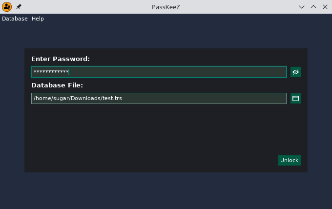

# PassKeeZ

A FIDO2/ Passkey compatible authenticator for Linux based on [keylib](https://github.com/r4gus/keylib).



| Browser | Supported? | Tested version| Notes |
|:-------:|:----------:|:-------------:|:-----:|
| Cromium   | &#9989;    | 119.0.6045.159 (Official Build) Arch Linux (64-bit) | |
| Brave | &#9989; | Version 1.60.118 Chromium: 119.0.6045.163 (Official Build) (64-bit) | |
| Firefox | &#128679; | 120.0 (64-bit) | sign-in works |
| Opera | &#9989; | version: 105.0.4970.16 chromium: 119.0.6045.159 | |

> INFO: All tests were conducted using the passkey sign-in option for Github.

## Features

* Works with all services that support Passkeys
* Store your Passkeys (just a private key + related data) in a local, encrypted database
* Constant sign-counter, i.e. you can safely sync your credentials/passkeys between devices.
* Manage your Passkeys directly in the App (WIP)

## Install

This project is installed by running the following command in your terminal.

```
sudo sh -c "$(curl -fsSL https://raw.githubusercontent.com/r4gus/keypass/master/script/install.sh)"
```

> The current project exclusively supports Linux due to the absence of a standardized API for interprocess communication (IPC) between the client and authenticator. As a workaround, platform authenticators on Linux act as virtual USB HID devices utilizing uhid. However, extending this functionality to other platforms remains unexplored as I haven't had the opportunity to investigate the equivalent mechanisms elsewhere.

### Manual installation

* First you need a [Zig 0.11.0 compiler](https://ziglang.org/download/).
* Also, the project uses [zenity](https://wiki.gnome.org/Projects/Zenity) as file browser. You might need to install it if your distro doesn't come with GTK natively. If zenity is not available, you have to enter file paths manually.
* Clone the project with `git clone https://github.com/r4gus/keypass`
* Build the project with `zig build run -Doptimize=ReleaseSmall`
* After successful compilation you can find the binary in `zig-out/bin/`
* Execute the script `script/postints.sh` using bash. This will create a new group `fido` and add the current user to the group. The script also enables the `uhid` module and adds a rule that allows users of the group `fido` to access `/dev/uhid` without root privileges.
* Finally, restart you Pc.

### File synchronization

You can synchronize your database files using a service like [Syncthing](https://docs.syncthing.net/intro/getting-started.html) between your devices. This allows you to use the same Passkeys to login to your accounts on multiple devices.

#### Syncthing

Please see the [Getting Started guide](https://docs.syncthing.net/intro/getting-started.html) on how to setup Syncthing on your device. Make sure you also setup Syncthing to [startup automatically](https://docs.syncthing.net/users/autostart.html#linux), to prevent a situation where your databases are out of sync.

> NOTE: For now, please make sure that you don't have the same database open on multiple devices simultaneously.

## Contributing

Currently this application and the surrounding infrastructure 
([keylib](https://github.com/r4gus/keylib), [zbor](https://github.com/r4gus/zbor), [tresor](https://github.com/r4gus/tresor))
is only maintained by me. One exception is the graphics library [dvui](https://github.com/david-vanderson/dvui) I use for the frontend.

If you find a bug or want to help out, feel free to either open a issue for one of the mentioned projects or write me a mail.

All contributions are wellcome! Including:

* Bug fixes
* Documentation
* New features
* Support for other systems (linux distros, OSs, ...)
* ...

## QA

<details>
<summary><ins>What is this project about?</ins></summary>

FIDO2 stands as a dedicated authentication protocol crafted for diverse authentication needs. Whether employed as a standalone method, supplanting traditional password-based authentication, or as an additional layer of security, FIDO2 serves both purposes. The FIDO Alliance has actively advocated for the widespread adoption of this protocol for several years, with 2023 witnessing a substantial surge in its adoption. However, it's crucial to note that FIDO2 introduces a heightened level of complexity in comparison to conventional passwords. Notably, the use of roaming authenticators, such as YubiKey, can be a cost-intensive aspect.

Upon initiating the keylib project in October 2022, my primary objective was to develop a library empowering individuals to transform their own hardware, such as ESP32, into a functional authenticator. I believe I've achieved this goal successfully. However, during this process, I also recognized the evolving trend favoring hybrid/platform authenticators with discoverable credentials, now commonly marketed as Passkeys.

While traditional authenticators like YubiKeys provide robust protection against various attacks, they come with notable drawbacks. Their high cost, limited update/patching capabilities, and restricted storage for discoverable credentials (for instance, my YubiKey 5 supports around 25 credentials) underscore these challenges. Additionally, the inability to back up data, although enhancing confidentiality, poses availability concerns. The official solution offered for this predicament is surprisingly simple: "buy a second one."

Conversely, platform authenticators present a more flexible and cost-effective alternative. Unlike traditional counterparts, they can undergo regular updates and patches, akin to any software component. Furthermore, these authenticators permit the backup and secure sharing of credentials, leveraging an encrypted database within this project.

One key advantage lies in their cost-effectiveness, eliminating the need for additional hardware. When implemented with precision, platform authenticators can attain a commendable level of security, providing a compelling alternative to their more expensive counterparts.

The primary objective of this project is to furnish an alternative —keeping in mind that the term "alternative" is subjective and, due to resource constraints, I may not offer a polished, "commercial-grade" product— to existing commercial Passkey implementations.

</details>

<details>
<summary><ins>What is FIDO2/ Passkey?</ins></summary>
Please read the QA of the [keylib](https://github.com/r4gus/keylib) project.
</details>

## Showcase

<table>
  <tr>
    <td></td>
    <td></td>
  </tr>
  <tr>
    <td></td>
    <td></td>
  </tr>
</table>

## Dependencies

* [keylib](https://github.com/r4gus/keylib)
* [zbor](https://github.com/r4gus/zbor)
* [tresor](https://github.com/r4gus/tresor)
* [dvui](https://github.com/david-vanderson/dvui)
